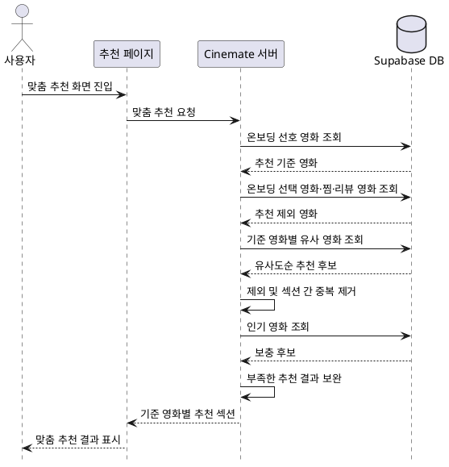

# 맞춤 추천

## 1. 추천 흐름

## 2. 영화 간 유사도

Seed 과정에서 Cinemate가 선정한 3,000개 영화와 MovieLens 사용자 평점을 이용해 영화 간 유사도를 미리 계산하고, 그 결과를 `movie_similarities` 테이블에 저장한다.

단순히 두 영화의 평균 평점을 비교하지 않고, 같은 사용자가 두 영화를 자신의 평소 평점 성향보다 높거나 낮게 평가했는지를 비교한다. 이를 통해 평점을 전반적으로 후하게 주거나 낮게 주는 사용자 간의 차이를 줄이고, 실제 선호 경향이 비슷한 영화를 찾는다.

신뢰도가 낮은 관계를 줄이기 위해 두 영화를 모두 평가한 사용자가 30명 이상인 경우만 계산 대상으로 사용한다. 계산 결과가 양수인 영화 관계를 유사도가 높은 순서로 정렬하고, 기준 영화마다 최대 50개를 저장한다.

런타임에서는 사용자의 온보딩 선호 영화를 기준 영화로 사용해 저장된 유사 영화를 조회하며, 유사도 자체를 다시 계산하지 않는다.

## 3. 추천 결과 구성

다음 영화는 추천 결과에서 제외한다.

- 온보딩에서 이미 선택한 영화
- 사용자가 찜한 영화
- 사용자가 리뷰한 영화
- 앞선 추천 섹션에서 이미 노출된 영화

유사 영화가 부족하면 `movie_stats`의 MovieLens 평점 수와 평균 평점을 기준으로 많은 사용자가 높게 평가한 영화를 보충한다.
