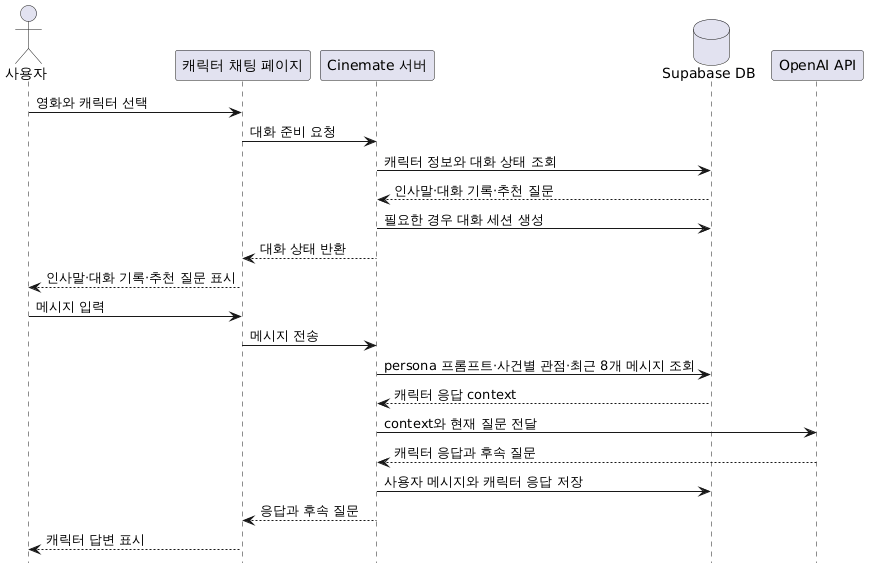

# 캐릭터 채팅

## 1. 캐릭터 채팅 흐름

## 2. 캐릭터 응답 구성

캐릭터 채팅은 별도 모델 학습 없이, 미리 구성한 캐릭터 데이터와 최근 대화 기록을 LLM에 전달해 응답을 생성한다.

LLM 입력에는 다음 정보가 포함된다.

- 캐릭터 이름, 설명, 성격과 말투를 정의한 persona 프롬프트
- 영화 안에서 실제로 일어난 주요 사건
- 각 사건에서 현재 캐릭터가 맡은 역할과 관점
- 사건이 캐릭터에게 남긴 감정과 변화
- 사건 시점에 캐릭터가 알고 있거나 모르는 사실
- 현재 사용자의 메시지와 최근 대화 8개

같은 사건이라도 캐릭터별 관점과 지식 상태를 별도로 저장한다. 이를 통해 캐릭터가 알 수 없는 사실을 단정하거나 다른 인물의 시점으로 답하는 문제를 줄인다.

LLM은 캐릭터 답변과 함께 사용자가 이어서 물어볼 후속 질문을 생성한다.

## 3. 캐릭터 채팅 데이터

캐릭터의 성격, 말투, 주요 사건과 관점은 MovieLens나 TMDB에서 제공되는 정보가 아니다. 영화 대본을 참고해 서비스용 seed 데이터로 구성하되, 대본 원문은 저장하지 않는다.

| 데이터 | 역할 |
| --- | --- |
| `characters` | 캐릭터 설명, 첫 인사, persona 프롬프트, 이미지 |
| `character_chat_events` | 영화에서 일어난 주요 사건의 객관 요약 |
| `character_chat_event_participants` | 사건별 캐릭터의 역할, 관점, 감정, 지식 상태 |
| `character_chat_default_questions` | 대화 시작 시 표시할 고정 질문 |
| `character_chat_conversations` | 사용자별 캐릭터 대화 세션 |
| `character_chat_conversation_messages` | 사용자와 캐릭터의 메시지, 동적 후속 질문 |
