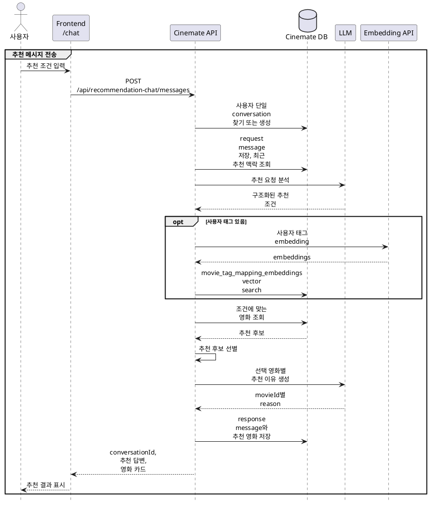

# AI 추천 채팅

## 1. AI 추천 채팅 흐름



## 2. 자연어 추천 조건 분석

LLM Input:

```json
{
  "currentMessage": "러닝타임 100분 이하인 1990년대 미국 액션 영화 중 속도감 있고 통쾌한 영화 추천해줘",
  "availableOptions": { 씨네메이트의 전체 장르 19개, 국가 65개, 언어 26개로 만든 객체 },
  "recentExchanges": [
    {
      "request": "2010년대 이후 개봉했고 러닝타임 90분 이하인 긴장감 있는 스릴러 추천해줘",
      "response": "요청하신 조건에 맞는 영화를 골라봤어요.",
      "movies": [
        {
          "id": 300669,
          "title": "맨 인 더 다크"
        },
        {
          "id": 376570,
          "title": "허쉬"
        },
        {
          "id": 181886,
          "title": "에너미"
        },
        {
          "id": 360784,
          "title": "히든"
        },
        {
          "id": 332567,
          "title": "언더 워터"
        }
      ]
    }
  ]
}
```

LLM Output:

```json
{
  "intent": "new_recommendation",
  "genreIds": [28],
  "countryCodes": ["US"],
  "languageCodes": [],
  "yearRange": {
    "from": 1990,
    "to": 1999
  },
  "runtimeRange": {
    "from": null,
    "to": 100
  },
  "userTagQueries": [
    {
      "userTag": "속도감 있는",
      "embeddingTerms": [
        "속도감 있는",
        "빠른 전개",
        "빠른 템포",
        "긴박한",
        "스피디한",
        "역동적인",
        "박진감 넘치는"
      ]
    },
    {
      "userTag": "통쾌한",
      "embeddingTerms": [
        "통쾌한",
        "시원한",
        "짜릿한",
        "쾌감 있는",
        "상쾌한",
        "유쾌한",
        "즐거운"
      ]
    }
  ],
  "excludedTerms": [],
  "confidence": 0.95
}
```


## 3. 사용자 표현과 Cinemate 태그 매핑

“속도감 있는”, “통쾌한” 같은 사용자 표현은 Cinemate 태그 이름과 정확히 일치하지 않을 수 있다. 이를 해결하기 위해 사용자 표현을 embedding으로 변환하고, 미리 embedding을 저장한 Cinemate 태그와 의미적 유사도를 비교한다.

한 요청에서는 사용자 태그를 최대 3개 사용하며, 각 사용자 태그마다 유사한 Cinemate 태그를 최대 3개 선택한다. 가장 유사한 태그의 similarity가 `0.45` 미만이면 해당 사용자 태그는 검색에서 제외한다.

예시는 다음과 같다.

```text
"속도감 있는" -> action packed(0.597), fast paced(0.591), exciting(0.583)
"통쾌한" -> fun(0.594), feel-good(0.572), light(0.540)
```

매핑된 Cinemate 태그는 `movie_tag_relevances`에 저장된 영화별 태그 관련도와 연결되어 후보 영화의 적합도를 계산하는 데 사용된다.

## 4. 후보 조회와 최종 순위

```text
메타데이터 필터링 → 기존 추천 영화 제외 → 태그 점수 계산 → 상위 5편 선정
```

### 4.1 메타데이터 후보 필터링

먼저 장르, 국가, 언어, 개봉 연도, 러닝타임을 모두 만족하는 영화만 DB에서 조회한다. 장르가 여러 개면 모든 장르를 포함해야 한다.

같은 대화에서 이미 추천한 영화는 후보에서 제외한다.

### 4.2 태그 점수 계산

태그 조건이 있으면 필터링된 각 후보에 대해 태그별 영화 점수를 계산한다. 사용자 태그와 Cinemate 태그의 유사도를 가중치로 사용하고, 영화와 Cinemate 태그의 관련도를 가중 평균한다.

```text
태그별 영화 점수
= Σ(사용자 태그–Cinemate 태그 유사도 × 영화–Cinemate 태그 관련도)
  ÷ Σ(사용자 태그–Cinemate 태그 유사도)
```

여러 사용자 태그가 있으면 태그별 영화 점수의 평균과 최솟값을 함께 반영한다.

```text
최종 태그 점수
= 태그별 영화 점수의 평균 × 0.7
  + 태그별 영화 점수의 최솟값 × 0.3
```

최솟값을 반영해 일부 태그만 강하게 만족하는 영화가 상위에 몰리는 것을 줄인다.

### 4.3 계산 예시와 최종 선정

후보 영화 A의 태그 관련도가 다음과 같다고 가정한다.

| 사용자 태그 | Cinemate 태그   | 사용자 태그–Cinemate 태그 유사도 | 영화–Cinemate 태그 관련도 |
| ------ | ------------- | ---------------------: | -----------------: |
| 속도감 있는 | action packed |                  0.597 |                0.9 |
| 속도감 있는 | fast paced    |                  0.591 |                0.8 |
| 속도감 있는 | exciting      |                  0.583 |                0.7 |
| 통쾌한    | fun           |                  0.594 |                0.8 |
| 통쾌한    | feel-good     |                  0.572 |                0.6 |
| 통쾌한    | light         |                  0.540 |                0.4 |

```text
속도감 있는 영화 점수
= (0.597×0.9 + 0.591×0.8 + 0.583×0.7)
  ÷ (0.597 + 0.591 + 0.583)
= 0.801

통쾌한 영화 점수
= (0.594×0.8 + 0.572×0.6 + 0.540×0.4)
  ÷ (0.594 + 0.572 + 0.540)
= 0.606

최종 태그 점수
= ((0.801 + 0.606) ÷ 2) × 0.7 + 0.606 × 0.3
= 0.674
```

영화 A의 최종 태그 점수는 `0.674`다. 필터링된 후보를 최종 태그 점수가 높은 순서로 정렬하고 최대 5편을 선택한다.

태그 조건이 없으면 MovieLens 평점과 Cinemate 리뷰를 합산한 표시 평점과 평가 수를 기준으로 최대 5편을 선택한다.

## 5. 추천 결과 저장

추천 채팅은 사용자당 하나의 대화를 유지한다. 사용자 요청과 AI 응답을 메시지로 저장하고, 응답에 포함된 영화는 추천 순위와 추천 이유를 함께 저장한다.

| 데이터 | 역할 |
| --- | --- |
| `recommendation_chat_conversations` | 사용자별 추천 대화 |
| `recommendation_chat_conversation_messages` | 사용자 요청, AI 응답, 검증된 분석 결과 |
| `recommendation_chat_conversation_message_movies` | 응답별 추천 영화, 순위, 추천 이유 |
| `movie_tag_mapping_embeddings` | Cinemate 태그 검색용 embedding |
| `movie_tag_relevances` | 영화와 Cinemate 태그의 관련도 |

추천 이유는 최종 영화가 결정된 뒤 LLM이 영화 정보와 일치하도록 생성한다. 추천 이유 생성에 실패하면 전체 추천을 버리지 않고 공통 추천 문구로 대체한다.
